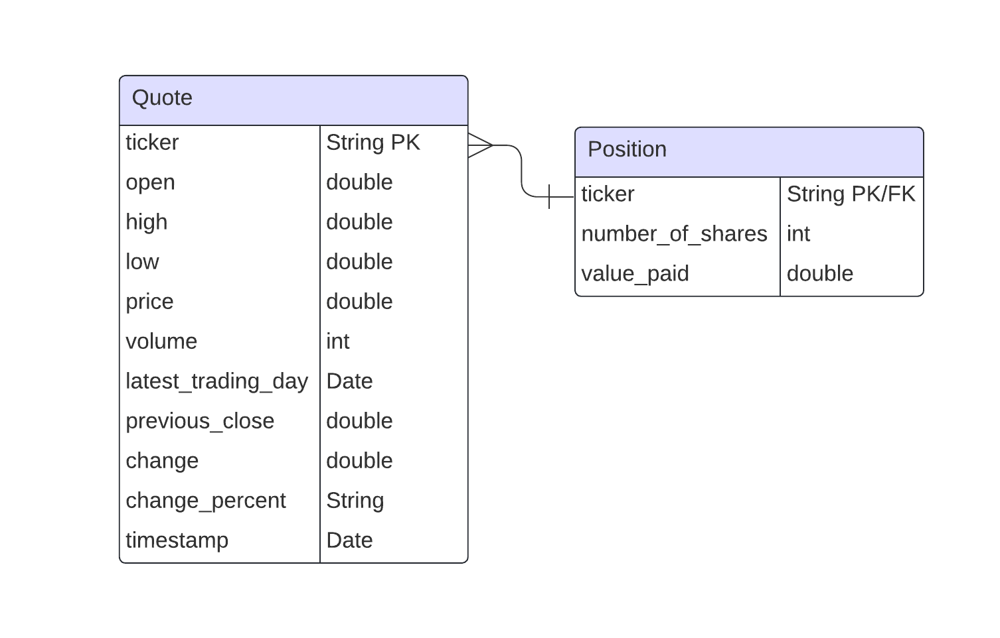

# Introduction
This stock trading application allows users to buy and sell stocks, track their investments,
and view real-time stock quotes. The app leverages Java with JDBC for database interactions,
PostgreSQL (PSQL) for data storage, and Maven for project management and dependencies.
It features a user-friendly console interface for stock transactions and investment management.

# Implementaiton
## ER Diagram

## Design Patterns
The application employs the DAO (Data Access Object) and Repository design patterns to
manage data persistence and retrieval. The DAO pattern abstracts the data access layer,
providing a clear separation between business logic and database operations.
Each DAO class (e.g., PositionDao) interacts with the database to
perform CRUD (Create, Read, Update, Delete) operations.
The Repository pattern builds on DAO by offering a more cohesive interface for data access,
integrating multiple DAOs into a unified service layer. This separation ensures a clean,
modular design and simplifies maintenance and testing.

# Test
Testing is performed using a combination of unit and integration tests
to ensure reliable database interactions. Database setup involves creating
a test schema and populating it with predefined test data. 
Test data setup includes inserting sample records for stock positions and quotes.
Tests validate database operations by comparing expected results with actual query outcomes.
Integration tests verify end-to-end functionality, ensuring that the application correctly
handles real-world scenarios.