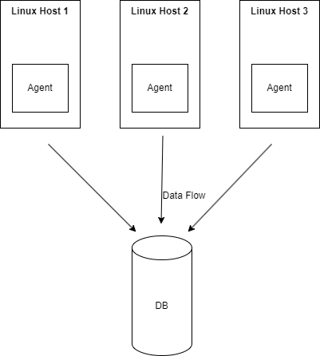

# Linux Cluster Monitoring Agent
This project is under development. Since this project follows the GitFlow, the final work will be merged to the main branch after Team Code Team.

# Introduction
The project aims to develop a monitoring application for gathering and storing hardware information and usage statistics from multiple Linux hosts into a PostgreSQL database. This application targets system administrators and DevOps engineers who need to monitor system performance metrics over time.

Technologies used include Bash scripting for automation, Docker for containerization of PostgreSQL, Git for version control, and SQL for database operations.

# Quick Start
### Start a PostgreSQL instance using Docker

```
bash psql_docker.sh start
```

### Create tables in the database
```
psql -h localhost -U postgres -d host_agent -f ddl.sql
```

### Insert hardware specifications data into the database
```
./scripts/host_info.sh localhost 5432 host_agent postgres password
```

### Insert hardware usage data into the database manually
```
./scripts/host_usage.sh localhost 5432 host_agent postgres password
```

### Setup crontab for automatic data collection every minute
```
* * * * * bash /home/rocky/dev/jarvis_data_eng_JohnTawadrous/linux_sql/scripts/host_usage.sh localhost 5432 host_agent postgres password > /tmp/host_usage.log
```

# Implemenation
The implementation of the Linux Cluster Monitoring Agent involves several key steps, including setting up a PostgreSQL database, developing Bash scripts for data collection and insertion, configuring automated data collection using crontab, and ensuring robust testing and deployment procedures.

## Architecture


# Scripts
### psql_docker.sh
This script is used to set up and manage a PostgreSQL instance using Docker.

#### Usage:
```bash
./psql_docker.sh start|stop|create [DB_USERNAME] [DB_PASSWORD]
```

### host_info.sh
This script collects hardware specifications of the host machine and inserts the data into the host_info table in the PostgreSQL database.
#### Usage:
```bash
./host_info.sh localhost 5432 host_agent postgres password
```

### host_usage.sh
This script collects current usage statistics of the host machine and inserts the data into the host_usage table in the PostgreSQL database.
#### Usage:
```bash
./host_usage.sh localhost 5432 host_agent postgres password
```

### crontab
The crontab job is set up to run the host_usage.sh script every minute to continuously collect data.
#### Usage:
```
* * * * * bash /home/rocky/dev/jarvis_data_eng_JohnTawadrous/linux_sql/scripts/host_usage.sh localhost 5432 host_agent postgres password > /tmp/host_usage.log
```

### queries.sql
This file contains SQL queries to analyze the collected data. The queries are designed to answer specific business questions such as average CPU usage, memory usage patterns, etc.
#### Usage:
```
-- Find the average memory usage for each host
SELECT hostname, AVG(memory_free) as avg_memory_free
FROM host_usage
JOIN host_info ON host_usage.host_id = host_info.id
GROUP BY hostname;
```


## Database Modeling
### `host_info`
| Column         | Data Type | Description                               |
|----------------|-----------|-------------------------------------------|
| id             | SERIAL    | Primary key, auto-incrementing ID         |
| hostname       | VARCHAR   | The hostname of the server                |
| cpu_number     | INT       | Number of CPUs                            |
| cpu_architecture | VARCHAR | CPU architecture (e.g., x86_64)           |
| cpu_model      | VARCHAR   | Model of the CPU                          |
| cpu_mhz        | FLOAT     | CPU speed in MHz                          |
| l2_cache       | INT       | L2 cache size in KB                       |
| total_mem      | INT       | Total memory in KB                        |
| timestamp      | TIMESTAMP | The time when the data was collected      |

### `host_usage`
| Column         | Data Type | Description                               |
|----------------|-----------|-------------------------------------------|
| timestamp      | TIMESTAMP | The time when the data was collected      |
| host_id        | INT       | Foreign key referencing `host_info(id)`   |
| memory_free    | INT       | Free memory in MB                         |
| cpu_idle       | INT       | CPU idle percentage                       |
| cpu_kernel     | INT       | CPU kernel percentage                     |
| disk_io        | INT       | Number of disk I/O operations             |
| disk_available | INT       | Available disk space in MB                |

# Test
The bash scripts were tested for functionality by running them manually and verifying data insertion into the database. Each script was tested with different inputs to ensure proper handling of data and database connections.

# Deployment
The application is deployed on GitHub with scripts managed in a structured directory. Crontab is configured to execute host_usage.sh every minute to ensure continuous data collection and insertion into the PostgreSQL database.

# Improvements
- Handle hardware updates dynamically
- Implement data aggregation for historical analysis
- Enhance error handling and logging in scripts